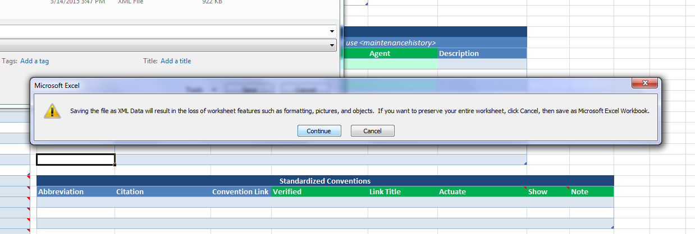
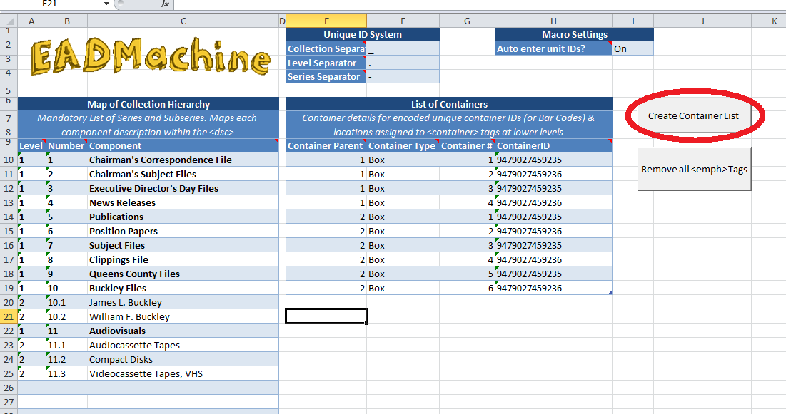
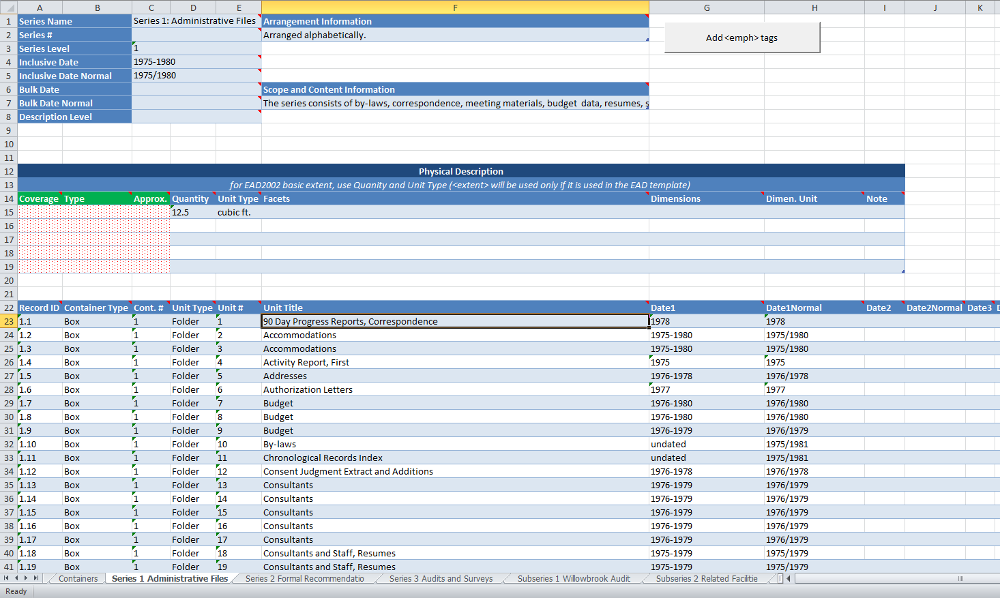

EADMachine
========

EADMachine is an easy EAD creation and editing tool. It uses a speadsheet template to enter data and automatically converts between spreadsheet and valid EAD, matching either a default template or a local EAD file. EADMachine also automatically creates a flat HTML finding aid for basic online access.

[Features](#features) 
[Setting up EADMachine](#setup) 
[Entering Data into the Spreadsheet Template](#dataentry) 
[Creating EAD and HTML files from the spreadsheet template](#creating) 
[Editing an completed EAD file with EADMachine](#editing) 

Features
----------

* Data-Entry using spreadsheet template
* Comments from the EAD tag library and formatting promote robust and consistent metadata
* Macro reads italicized and bold text and automatically inserts <emph> tags
* Formula automates customizable unique identifiers at every level
* Make use of familiar features like spellcheck, find and replace, etc. 
* 100% native XML behind the scenes
* Uses an EAD Template to match local tag and attribute usage
* Use a default template or your own local EAD file
* Make small customizations by adding or changing elements or attributes within the EAD template
* Uses automated and customizable unique ID system
* Encode unique IDs at every level
* Not container-dependent
* Supports both EAD2002 and EAD3
* Includes new <control> elements, including refined revision and maintenance elements
* Includes experimental <relations> element
* Adds all complex elements at any level
* Automatically produces a flat HTML finding aid
* Produces text files that are easily inspected and edited 
* Complied to C to be run on any Windows Machine as .exe application 
* Runs entirely on Windows desktop, no server required
* Free and open-source GNU-GPL license 

Setting up EADMachine
---------------------------

Select “Download ZIP” on the right side of the EADMachine page in Github.  

Unzip the file to anywhere on your computer. You should have these items:
* docs
* source
* templates
* EADMachine.exe
* EADMachine.xlsm
* error_log.txt
* LICENCE.txt
* README.html
* README.md

EADMachine.xlsm is the spreadsheet template where you should enter data that describes your collection. Make sure to make a use copy of your spreadsheet and keep the original for additional collections. See the instructions below for entering data into the spreadsheet template.

When you are finished filling the spreadsheet, save the collection as an .xml file. Excel will warn you that you will lose formatting information when doing this, but click “continue” as seen below:

Next, open up EADMachine.exe and follow the instructions for converting the XML file you just saved to EAD and HTML files. See Creating an EAD and HTML files from the spreadsheet template for more details.

Entering Data into the Spreadsheet Template
-----------------------------------------------------

###Collection-level Description

Open up EADMachine.xlsm in Microsoft Excel 2007 or later (you may be able to use an older version of Excel with an add-on, but that method has not been tested). You should see a screen like this:

Enter description for your collection using the labels provided. Hover over the red tabs in the cell corners for more details on individual cells. Much of this information comes directly from the EAD tag library.

You may also enter XML mixed content in fields. An example of this would be: <title>Title of a Book</title> is a good book.

Formatting will not be retained, so you must manually enter tags like <emph render=”italic”>Text</emph> to italicize text, etc.

The green tables are fields that are only used in EAD3. If you plan to use EAD2002, feel free to ignore these fields.

The fields that contain red dots require one of a few specified terms. Hover over the red tab to see what these terms are. If you do not enter a correct term, your finding aid will not be valid.

The different sheets at the bottom (circled in red above) lead to other sheets with more fields. Be sure to look at all fields to see what is applicable, but do not feel the need to fill in everything. Many detailed finding aids look very empty in the spreadsheet.

Feel free to insert new row and resize and move any tables. There is no set location for each table, even move them between sheets to customize the template as you like. The only requirement is that all fields must be present or you will get an error when saving as .xml – no removing tables.

###Container Lists

EADMachine supports complex file or even item level container lists. When you are ready to enter your container list, navigate to the “Containers” sheet:

In the Map of Collection Hierarchy table list each component (usually series and subseries). In the example above, series are bolded and subseries are not.

The Level is mandatory, it is the level within the hierarchy. For example, series are usually 1, subseries usually 2, etc. 

The number is an ID for each component, it is suggested and not mandatory. If the unique ID system is used, it will be combined with the collection separator (in the top-center table) and the collection ID to make a unique identifier. This will be encoded as a <unitid> element or an @id attribute of the component element, depending on the EAD template you use.

Once you have completed filling in the Map of Collection Hierarchy table, click the “Create Container List” button on the upper right (circled in red). This will unhide the necessary sheets for each component. See Component Level Description to fill in data at the lower levels.

###Container IDs

The List of Containers table allows you to encode container IDs, such as barcodes. 

List each container type (such as “Box”) and container number along with the parent component ID (such as the series or subseries ID).

EADMachine will find all the matching containers in your container list and enter the ID as an @id attribute. The use of the parent ID allows the repeating of container numbers (such as a Box 1 for multiple series).

###Entering Component-level Description

To enter component-level description, such as a file inventory for a series, you must have first entered you Map of Collection Hierarchy and clicked the “Create Container List” button.

A new sheet should have appeared with the component name. Navigate to this sheet and fill whatever component-level description you would like on the top of the sheet. 

If the component you are describing, say, directly contains only subseries and no files or items, leave the large table on the bottom blank.

If the component you are describing contains files or items, enter either “file” or “item” or another term to identify the level of the items you will enter into the large table at the bottom.

The RecordID field is designed to be a unique identifier for each file or item. You may use the default formula designed to combine the Container and Unit numbers. If you use the formula, the ID visible will be combined with the Series # and the Collection ID to create a unique identifier.

Both the Container Type and the Unit Type and the corresponding numbers will be entered into <container> tags, unless you use a different EAD template, then EADMachine will match the data as close as possible.
Up to five dates may be used, normalized dates are also recommended to make this information more computer-readable. 

EADMachine will be able to encode <unitdatestructured> tags for EAD3 if you use a hyphen(-) for date ranges and a forward slash(/) for  normal date ranges.

Any date format can be used, the Date1, etc. will be encoded as a <unitdate> and the Normal version will be encoded as an @normal attribute.

EADMachine also supports <physdesc> and <physdescstructured> as well as digital objects at the lower-level. Use the comments for more information.

Formatting will not be retained, so you must manually enter tags like <emph render=”italic”></emph> to italicize text, etc.

EADMachine can also auto enter <emph> tags at the component level and below. Just italicize or bold text as you typically would in Excel and when the component is complete, click the “Add <emph?> tags> button on the top of the sheet.

Adding the <emph> tags is very resource intensive, particularly for large blocks of text. For this reason, this feature is only available at the component level and below.

###More Information

If you would like further instruction on entering metadata, consult the following standards and sources:

[Describing Archives: A Content Standard](http://www2.archivists.org/groups/technical-subcommittee-on-describing-archives-a-content-standard-dacs/dacs)
[The Official EAD Tag Library](http://www.loc.gov/ead/tglib/)
[EADiva](http://www.eadiva.com)
[University of Texas iSchool EAD Tutorial](https://tutorials.ischool.utexas.edu/index.php/Introduction_to_EAD)

While these standards provide more detailed instructions on how to describe collections, creating metadata is rarely just following instructions. Use your best judgement while following guidelines as closely as possible.

Creating EAD and HTML files from the spreadsheet template
----------------------------------------------------------------------

When you have finished entering all you data for the entire collection, save the spreadsheet as an XML file and use the EADMachine.exe file to convert it to EAD.

To do this select “File” from the top menu bar and click on “Save as”

 
When naming the file, be sure to select “XML Data” as the file type.

 
Next, open EADMachine.exe and under the “Spreadsheet to EAD” tab, click “Browse” and select the XML file you just saved.

For an EAD template, use one of the default templates in the “templates” folder or use your own complete EAD file.

One you click “Next,” EADMachine will ask you some basic yes or no questions (such as whether you want an HTML file for basic web access) and then create your EAD file. Save your file(s) wherever you wish.

Editing an completed EAD file with EADMachine
-------------------------------------------------------

Open EADMachine.exe and select the “EAD to Spreadsheet” tab.

Browse and navigate to the EAD file you want to edit and click “Next.”

You will be prompted to save an XML file, which you will then import into the EADMachine spreadsheet.

Open EADMachine.xlsm and click on the “Developer” tab on the top menubar.

This tab is usually hidden by default, so if it is not visible, you need to enable it. Under the File tab, click “Options,” and select “Customize Ribbon.” Under “Main Tabs, check the “Developer” check box.

More detail instructions are available here:
[https://msdn.microsoft.com/en-us/library/bb608625.aspx](https://msdn.microsoft.com/en-us/library/bb608625.aspx)

Once you open the Developer tab, click “Import” as shown below, and select the XML file you created with EADMachine.

If you do not receive an error message, update the file as needed, save as an XML file, and convert it back to an EAD file. For more information see Entering Data into the Spreadsheet Template
and Creating EAD and HTML files from the spreadsheet template.

If you see one of the errors below, only part of the spreadsheet will be populated:

The reason for these errors is that the data from your finding aid does not fit the default tables in the EADMachine spreadsheet. 

The tables will expand as needed, unless they encroach upon another table. The tables within the spreadsheet have been placed fairly close to one another in order to fit as much information onto smaller monitors.

If you receive one of these import errors you must insert more rows after the table that is expanding. Unfortunately, Excel does not show which table cannot expand.

Examine your EAD file to see which fields may expand more typically than usual. The import will stop just before the offending table.

Examples of this issue would be an <arrangement> element at the component level with more than four paragraphs, or a <bibliography> of more than 3 published materials.

One you expand the table, import the XML file again to fully populate the spreadsheet.

